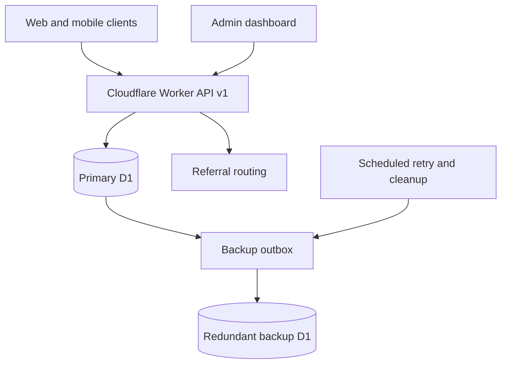

# Caveman Vs Dragon Backend

Cloudflare Workers + D1 backend for Caveman Vs Dragon player accounts, the global leaderboard, privacy-minimized analytics, admin operations, sharing/referrals, redundant recovery, and the future Private Leaderboards feature.

## Current milestone

This repository contains the complete local **server foundation (v0.1)**. It is not deployed, and the released game has not yet been switched away from Lovable/Supabase.

Implemented now:

- API v1 on a Cloudflare Worker.
- Separate development and production D1 configuration.
- Password-based player accounts, opaque cross-device sessions, and optional encrypted recovery email storage.
- Server-side name validation for empty/whitespace names, allowed characters, the 10-character limit, and profanity.
- One global leaderboard entry per player, with the highest score only.
- Stable ranking: manual admin rank first, then score descending, earliest achievement, and player ID.
- Platform/source/device/control metadata for Android, iOS, and Web.
- Rich anonymous event analytics using a random installation ID, UTC timestamps, declared device metadata, and coarse country/region.
- No raw IP, GPS, IMEI, serial number, MAC address, advertising ID, contacts, or aggressive fingerprint.
- Admin dashboard with edits, soft delete, reorder, undo, CSV export, analytics, audit history, backup status, clear, and restore.
- Two separate confirmations for **Clear Global Leaderboard**.
- Primary-only clear: the visible main leaderboard is soft-deleted; the backup database is intentionally untouched.
- Redundant D1 backup journal/snapshots with immediate background replication and five-minute retry.
- Two-confirm rebuild of the primary leaderboard from preserved backup score history.
- Share/referral services for Facebook, Instagram/native share, X, email, Telegram, and WhatsApp, including personalized score text, media/link metadata, attribution, and app/web routing.
- Future Private Leaderboards schema and disabled feature flag, without prematurely exposing public endpoints.
- Permanent player privacy deletion, including player-linked primary data and backup redaction/tombstone propagation.

Client work deliberately remains a later rollout phase: save the first valid name locally, prompt for name/password on the first qualifying score, auto-submit later scores, add share buttons at the title/score/leaderboard screens, and replace the existing Supabase calls only after dev API validation.

## Architecture



The backup path is deliberately asymmetric. Normal mutations are journaled to the redundant D1 database. The administrator's global-clear operation writes only to primary D1, so the last raw leaderboard history remains recoverable. Later player/admin mutations again replicate normally.

Cloudflare D1 also supplies automatic Time Travel point-in-time recovery. Cloudflare currently documents a 30-day window on Workers Paid and 7 days on Workers Free. The separate backup D1 exists because the product requires live redundancy and because the primary-only clear must not erase the preserved copy.

## Repository layout

| Path | Purpose |
| --- | --- |
| `src/index.ts` | Worker routes, middleware, scheduled tasks |
| `src/accounts.ts` | Registration, login, session, privacy deletion |
| `src/leaderboard.ts` | Highest-score-only submission and ranking |
| `src/analytics.ts` | Strict privacy-minimized telemetry ingestion |
| `src/sharing.ts` | Share metadata, referral attribution, routing |
| `src/admin.ts` | Edit/delete/reorder/undo/export/clear/restore/analytics |
| `src/admin-ui.ts` | Self-contained admin dashboard |
| `src/backup.ts` | Redundant backup outbox replication and privacy redaction |
| `migrations/` | Versioned primary D1 schema |
| `backup-migrations/` | Redundant backup D1 schema |
| `docs/` | API, operations, client rollout, and requirements |
| `test/` | Unit and Worker+D1 integration tests |

## Local setup

Requirements: Node.js 22 or later and a Cloudflare account for remote environments.

```bash
npm install
cp .dev.vars.example .dev.vars
npm run db:migrate:local
npm run backup:migrate:local
npm run dev
```

Set these secrets in `.dev.vars` locally and with `wrangler secret put` remotely:

- `ADMIN_API_TOKEN`: long random admin token. Put Cloudflare Access in front of `/admin*` in production as an additional layer.
- `RATE_LIMIT_SECRET`: independent random secret used to HMAC temporary IP rate-limit buckets. Raw IP values are never stored.
- `RECOVERY_EMAIL_KEY`: optional 32-byte AES key encoded as base64; required when accepting a recovery email.

Passwords use per-player salts and PBKDF2-HMAC-SHA256 with a production floor of 600,000 iterations, matching OWASP's current PBKDF2 guidance. Benchmark this in the deployed Worker before launch while retaining that minimum.

Before a remote deployment, create four D1 databases (development primary/backup and production primary/backup), replace the placeholder database IDs in `wrangler.jsonc`, and set the real development Worker subdomain.

## Quality checks

```bash
npm run typecheck
npm test
```

The integration suite bundles the actual Worker, runs it in Cloudflare's local workerd/Miniflare runtime, applies both D1 schemas, and verifies registration, highest-score-only behavior, analytics privacy, double-confirm clear, unchanged backup state, undo, and restore.

## Rollout sequence

1. Publish this implementation to the dedicated `cavemanvsdragon-server` GitHub repository.
2. Provision development primary/backup D1 databases and Worker secrets.
3. Deploy only the development Worker and apply versioned migrations.
4. Run the API/admin/backup smoke checklist in `docs/OPERATIONS.md`.
5. Integrate the web client behind a configurable API base URL.
6. Integrate the packaged Android client and verify offline/error behavior.
7. Run parallel-read validation against the existing leaderboard.
8. Switch score writes and analytics to the Worker.
9. Verify production recovery, then remove Supabase/Lovable leaderboard traffic.
10. Add the client share/referral controls.
11. Enable Private Leaderboards only after a separate product/security review.

## Reference documentation

- [Cloudflare D1 binding API](https://developers.cloudflare.com/d1/worker-api/)
- [Cloudflare D1 migrations](https://developers.cloudflare.com/d1/reference/migrations/)
- [Cloudflare D1 Time Travel and backups](https://developers.cloudflare.com/d1/reference/time-travel/)
- [Cloudflare Workers testing](https://developers.cloudflare.com/workers/testing/vitest-integration/)

See [API.md](docs/API.md), [CLIENT_INTEGRATION.md](docs/CLIENT_INTEGRATION.md), [OPERATIONS.md](docs/OPERATIONS.md), and [REQUIREMENTS.md](docs/REQUIREMENTS.md).
